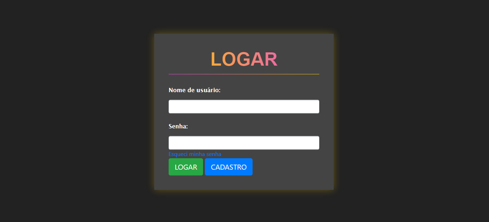
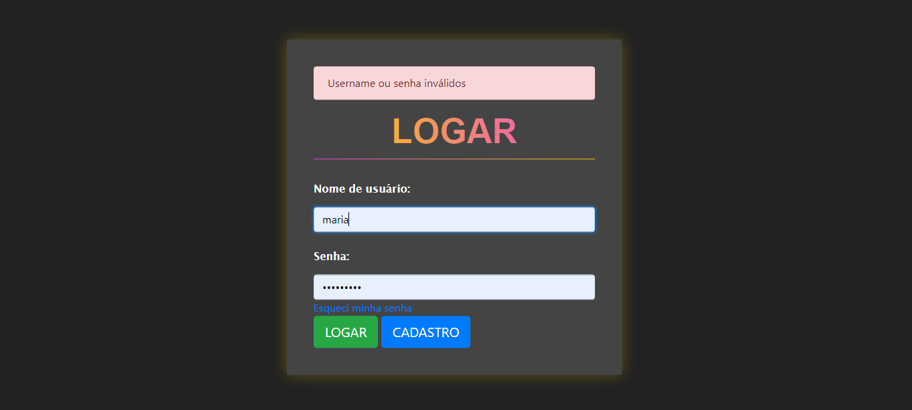
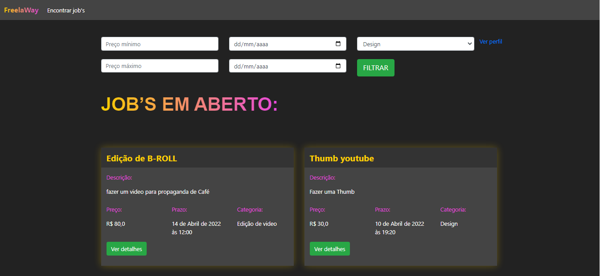
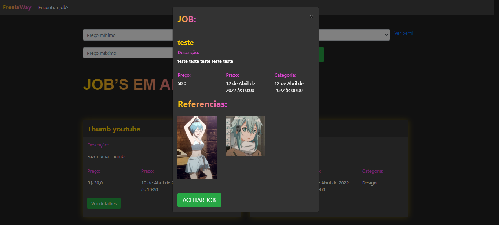
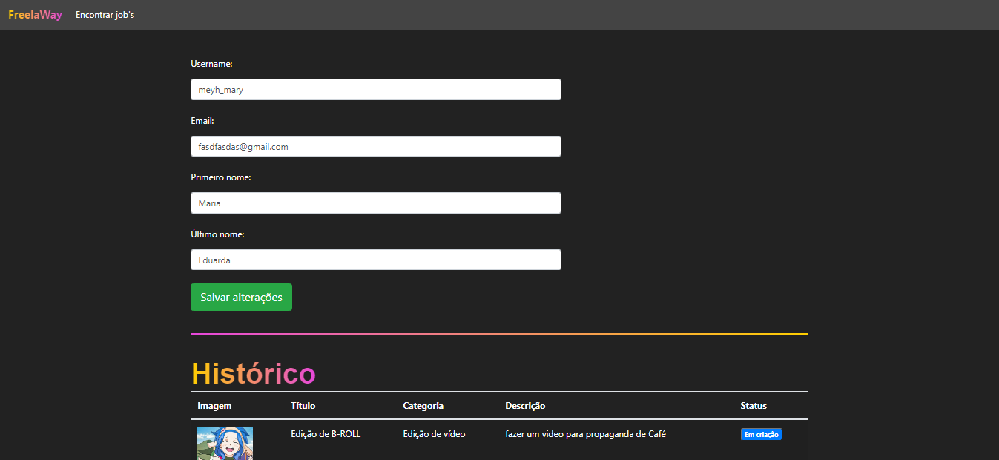

<h1 align="center">
    Freelaway
</h1>

<p align="center">
 

  
</p>

## 🚀 Tecnologias

Tecnologias e práticas utilizadas

- Python
- Django 4
- SQLite
- Arquitetura MVT

</br>

# Descrição

<p>
    A idea da plataforma é conectar empresas que precisam de serviços de design ou edição de vídeo com Freelancers.
</p>

</br>

# Funcionalidade
    - Autenticação e Cadastro de Usuário
    - Listagem
    - Detalhes e Aceite de Jobs
    - Atualização de Perfil
    - Listagem de Jobs Aceitos e Envio de Arquivos
    - Recuperação de senha

<h1 align="center"> 
	 Projeto
</h1>

<h1 align="center">
  
</h1>

<h1 align="center">
  
</h1>

<h1 align="center">
  
</h1>

<h1 align="center">
  
</h1>

<h1 align="center">
  
</h1>

<h1 align="center">
  
</h1>

<br/>

### Comandos: criar e ativar o ambiente virtual

```bash
# Criar (windows) 
python -m venv venv

# Ativar (windows)
$ venv/Scripts/Activate

# Rodar o servidor
$ python manage.py runserver

```

### Instalar bibliotecas, instalar requerimentos

```bash
(env) pip install django
(env) pip install pillow

(env) pip freeze > requirements.txt
(env) pip install -r requirements.txt

```
